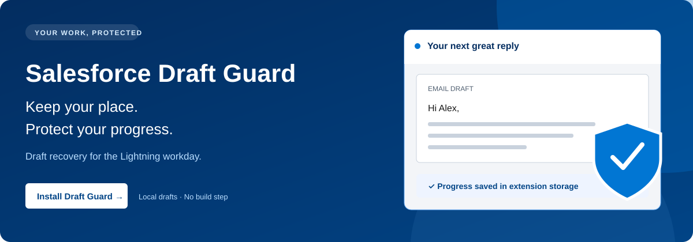
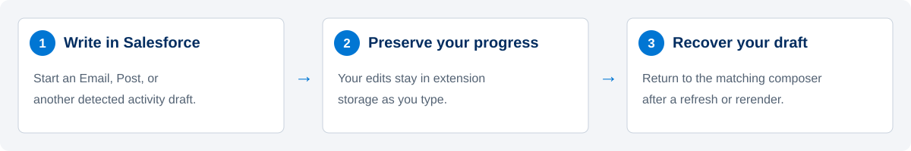
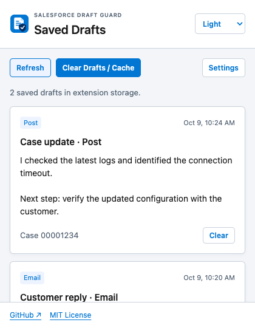
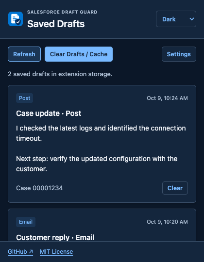
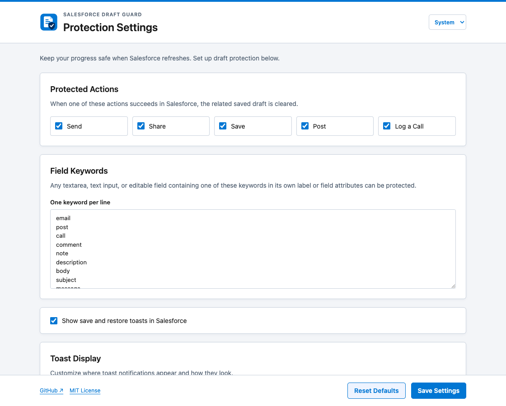
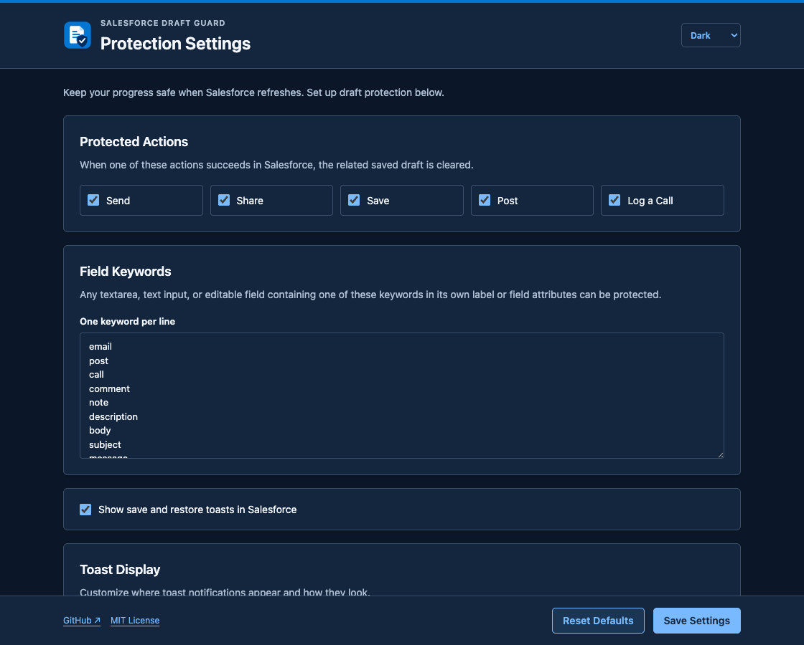
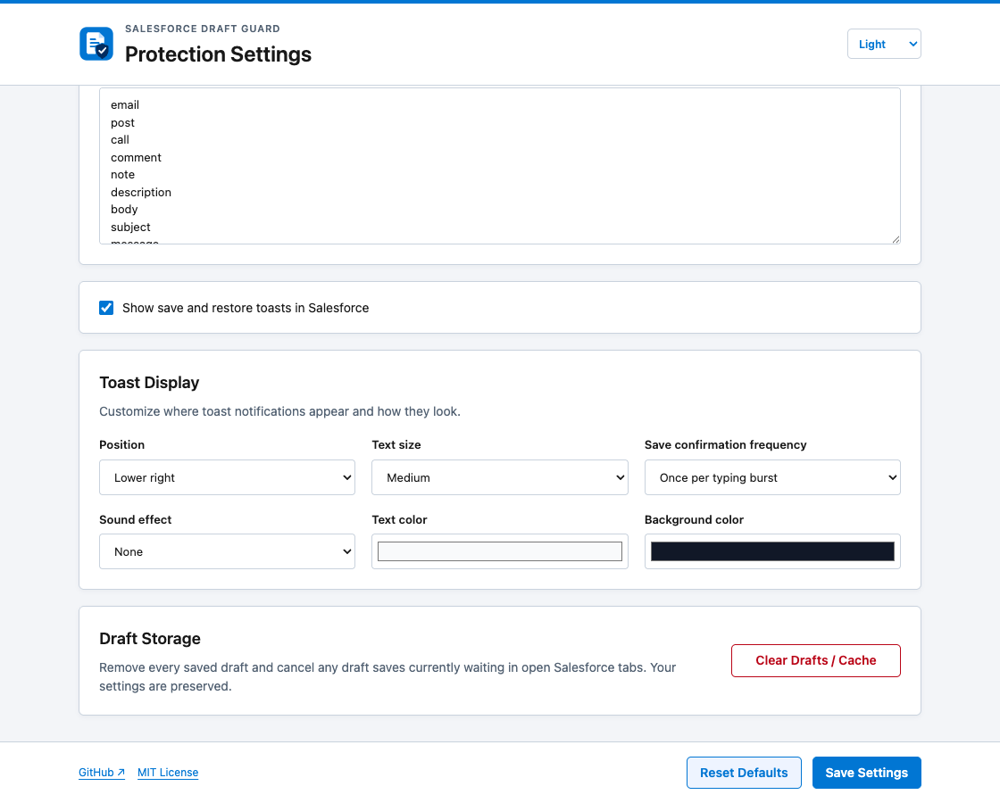
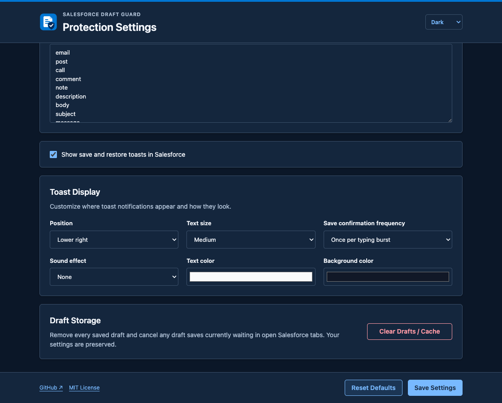

<p align="center"><a href="#install"></a></p>
<h1 align="center">Salesforce Draft Guard</h1>
<p align="center"><strong>Write your reply. Keep your progress. Recover your draft.</strong></p>
<p align="center">
  
  
  
  <a href="#github-issues"></a>
  <a href="LICENSE"></a>
</p>
<p align="center"><a href="#install">Install</a> · <a href="#everyday-use">Use it</a> · <a href="#settings">Settings</a> · <a href="#github-issues">Issues</a> · <a href="#privacy-and-permissions">Privacy</a> · <a href="#contributing">Contribute</a></p>

Protect Salesforce Lightning Email, Post, and other detected activity drafts from refreshes, frame reloads, and transient UI resets. Review saved text from the toolbar and clear drafts when you choose.

<p align="center"></p>

| Keep writing | Recover progress | Stay in control |
| --- | --- | --- |
| Detected text inputs, textareas, and rich-text composers save as you type. | Drafts restore when the matching Salesforce composer returns. | Review drafts, clear one or all, and customize protection and notifications. |
| Tab, record, composer, and field identity isolate drafts. | Email saves the authored reply above its existing signature and quoted history. | Extension pages offer System, Light, and Dark appearances. |

> [!IMPORTANT]
> Protection uses Salesforce markup and request heuristics. Verify your org’s Email/Post workflow before relying on recovery. Case Details field enhancements remain in the [GitHub backlog](https://github.com/teezyyoxo/salesforce-draft-guard/issues?q=is%3Aissue%20is%3Aopen%20label%3Aenhancement). Draft Guard is a recovery aid, not a durable backup.

<table><tr>
<td width="33%"><a href="#install"></a></td>
<td width="33%"><a href="#settings"></a></td>
<td width="33%"><a href="#github-issues"></a></td>
</tr></table>

## Install

**Chrome · Manifest V3 · No build step**

1. Download the [main-branch source ZIP](https://github.com/teezyyoxo/salesforce-draft-guard/archive/refs/heads/main.zip), or clone the repository. GitHub access is required while the repository is private; no releases are currently published.
2. Extract the ZIP into a folder you plan to keep.
3. Open `chrome://extensions` and turn on **Developer mode**.
4. Choose **Load unpacked** and select the folder containing `manifest.json`.
5. Refresh your Salesforce tabs.

<details>
<summary>Install from source or update an existing installation</summary>

```bash
git clone https://github.com/teezyyoxo/salesforce-draft-guard.git
cd salesforce-draft-guard
```

For this checkout, load `/Users/mgray/GitHub/SFsaver`. To update a clean checkout, run `git pull --ff-only`, click the extension’s reload button in `chrome://extensions`, then refresh Salesforce tabs. Review [CHANGELOG.md](CHANGELOG.md) first: upgrading from a pre-0.6.3 build purges old drafts while preserving settings.

The manifest uses related-frame matching, so use a current Chrome version. Other Chromium browsers may support unpacked installation but have not been validated here.

</details>

## Everyday use

1. Type in a protected Salesforce composer such as **Email** or **Post**. Saving happens as you edit.
2. Refresh or return after Salesforce rerenders the composer. The extension attempts recovery only for the matching, verified record/composer context.
3. Send, Share, Save, Post, or Log a Call normally. A successful matching request clears the related drafts; unrelated record saves do not clear a message draft.

Open the extension toolbar icon to review saved drafts. **Clear** removes one entry; **Clear Drafts / Cache** removes all saved drafts and cancels pending saves in open Salesforce frames. Both preserve settings. The popup reviews text; recovery happens inside Salesforce.

### Demonstration: review saved drafts

<table><tr><th>Light</th><th>Dark</th></tr><tr>
<td></td>
<td></td>
</tr></table>

## Settings

Choose **Settings** in the popup, or open the extension’s options from `chrome://extensions`.

| Control | What it changes |
| --- | --- |
| Protected Actions | Clears related drafts after these enabled actions succeed: Send, Share, Save, Post, Log a Call. |
| Field Keywords | Matches a field’s own label/attributes; one keyword per line. Defaults cover email, post, call, comment, note, description, body, subject, and message. |
| Show toasts | Enables/disables save and restore notifications. |
| Toast Display | Position, text size, save confirmation frequency, text/background colors, and optional sound. |
| Appearance | **System** by default, or explicit Light/Dark. Shared between popup and settings; does not change Salesforce toasts. |
| Draft Storage | Clears all drafts and live cache without resetting preferences. |
| Save Settings / Reset Defaults | Saves protection/notification preferences, or restores those defaults. Appearance is preserved. |

### Demonstration: configure protection

<table><tr><th>Light</th><th>Dark</th></tr><tr>
<td></td>
<td></td>
</tr></table>

<details>
<summary>Notification controls and draft storage in both themes</summary>




</details>

Screenshots capture the actual extension pages in a disposable browser profile. Draft examples are synthetic, with no customer data. They demonstrate the popup and settings; live Salesforce recovery still needs testing in your org. Only the main content scrolls; headers, appearance controls, and footers remain visible. On narrow screens, the action controls wrap.

## GitHub issues

[Open reports](https://github.com/teezyyoxo/salesforce-draft-guard/issues?q=is%3Aissue%20is%3Aopen) · [Closed reports](https://github.com/teezyyoxo/salesforce-draft-guard/issues?q=is%3Aissue%20is%3Aclosed) · [All reports](https://github.com/teezyyoxo/salesforce-draft-guard/issues?q=is%3Aissue)

<!-- github-issues:start -->
Snapshot checked 2026-10-09. **9 open · 8 closed.**

| GitHub report | Status | Labels |
| --- | --- | --- |
| [#1 DG-001: Post recovery adds extra line breaks](https://github.com/teezyyoxo/salesforce-draft-guard/issues/1) | **Closed** | bug, P1, historical-backlog |
| [#2 DG-002: Email drafts save but do not restore](https://github.com/teezyyoxo/salesforce-draft-guard/issues/2) | **Closed** | bug, P0, historical-backlog |
| [#3 DG-003: Save toast placement and appearance need configuration](https://github.com/teezyyoxo/salesforce-draft-guard/issues/3) | **Closed** | bug, P1, historical-backlog |
| [#4 DG-004: Protect Case Details: Plan of Action &gt; What](https://github.com/teezyyoxo/salesforce-draft-guard/issues/4) | **Open** | enhancement, P1, historical-backlog |
| [#5 DG-005: Protect Case Details: Internal Resolution Summary](https://github.com/teezyyoxo/salesforce-draft-guard/issues/5) | **Open** | enhancement, P1, historical-backlog |
| [#6 DG-006: Protect Case Details: Resolution Summary](https://github.com/teezyyoxo/salesforce-draft-guard/issues/6) | **Open** | enhancement, P1, historical-backlog |
| [#7 DG-007: Repeated recovery compounds line breaks](https://github.com/teezyyoxo/salesforce-draft-guard/issues/7) | **Closed** | bug, P1, historical-backlog |
| [#8 DG-008: Verify rich-text formatting and line-break recovery](https://github.com/teezyyoxo/salesforce-draft-guard/issues/8) | **Open** | P1, historical-backlog, verification |
| [#9 DG-009: Add a composer-anchored toast position](https://github.com/teezyyoxo/salesforce-draft-guard/issues/9) | **Open** | enhancement, P2, historical-backlog |
| [#10 DG-010: Re-verify backspace and delete after draft recovery](https://github.com/teezyyoxo/salesforce-draft-guard/issues/10) | **Open** | P1, historical-backlog, verification |
| [#11 DG-011: Post draft fails to restore after opening Email first](https://github.com/teezyyoxo/salesforce-draft-guard/issues/11) | **Closed** | bug, P1, historical-backlog |
| [#12 DG-012: Complete live-org Email composer verification](https://github.com/teezyyoxo/salesforce-draft-guard/issues/12) | **Open** | P1, historical-backlog, verification |
| [#13 DG-013: Sent drafts reappear and reused composers mix Case drafts](https://github.com/teezyyoxo/salesforce-draft-guard/issues/13) | **Closed** | bug, P0, historical-backlog |
| [#14 DG-014: Long tickets gain blank height and recovery steals focus](https://github.com/teezyyoxo/salesforce-draft-guard/issues/14) | **Closed** | bug, P1, historical-backlog |
| [#15 DG-015: Cross-Case recovery and quoted Email history capture](https://github.com/teezyyoxo/salesforce-draft-guard/issues/15) | **Closed** | bug, P0, historical-backlog |
| [#16 DG-016: Intermittent text field / composer container mutation](https://github.com/teezyyoxo/salesforce-draft-guard/issues/16) | **Open** | bug, known-issue, needs-reproduction |
| [#17 DG-017: Hyperlink modal layout interference](https://github.com/teezyyoxo/salesforce-draft-guard/issues/17) | **Open** | bug, known-issue, needs-reproduction |
<!-- github-issues:end -->

The table is generated from actual repository issues and includes closed reports, marked **Closed**. Refresh it with `node scripts/sync-issues.cjs`. All 15 historical DG entries now link to actual GitHub reports, including closed resolved reports. The still-occurring intermittent field/container mutation is open as [DG-016 / #16](https://github.com/teezyyoxo/salesforce-draft-guard/issues/16), with no reliable reproduction yet. The hyperlink modal layout observation is tracked as [DG-017 / #17](https://github.com/teezyyoxo/salesforce-draft-guard/issues/17); cause and reproduction remain unconfirmed.

## Privacy and permissions

- **Storage:** draft text stays in extension session storage where available, with local storage as a fallback. Session drafts are not a durable browser-restart backup. Settings use Chrome sync storage when available; appearance uses local storage.
- **Salesforce host access:** content scripts run on the Salesforce and Visualforce domains listed in `manifest.json`, including matching frames, to detect editors and recover text. The page bridge observes successful write requests for cleanup.
- **No telemetry or external draft service:** draft text is not sent to an extension backend. Salesforce still receives content through its normal Save/Send actions.
- **No clipboard or cookie permission:** the only general permission is `storage`.
- Drafts can contain sensitive text. Use the clear controls when needed. GitHub links open only when selected; extension pages load their assets locally.

See [draft identity, recovery, Email boundaries, and cleanup details](docs/DRAFT_BEHAVIOR.md).

## Troubleshooting

| Symptom | Try this |
| --- | --- |
| Nothing saves or restores | Reload the extension and refresh Salesforce. Confirm the field’s own label matches a keyword and the record context is unambiguous. |
| Draft does not reappear | Open the original Case and composer in the same browser tab. Hidden or ambiguous composers defer or reject recovery for isolation. |
| Formatting, focus, or layout looks wrong | Record a sanitized reproduction, browser/extension versions, and editor variant. Compare with Draft Guard disabled and consult [GitHub issues](https://github.com/teezyyoxo/salesforce-draft-guard/issues). |
| Draft remains after Send/Share | Confirm the action is enabled. Cleanup requires a successful request matching the submitted composer. Clear manually if needed. |

Enable debug logging only when investigating; [instructions](docs/DRAFT_BEHAVIOR.md#debug-logging) explain how. Remove sensitive draft/record details from logs before sharing.

## Contributing

No package installation or build is needed for the extension. Run its checks with Node.js:

```bash
node --check content.js
node --check injected.js
node --check options.js
node --check popup.js
node --check theme.js
node --check draft-storage.js
node --check background.js
node --test
```

With Playwright and its Chromium browser installed (`npm install --no-save --package-lock=false playwright` then `npx playwright install chromium`), `node scripts/capture-ui.cjs` verifies the extension pages and regenerates screenshots using a disposable profile. `node scripts/sync-issues.cjs` uses authenticated `gh` access to refresh issue status. See [CHANGELOG.md](CHANGELOG.md) and [the manual verification checklist](docs/DRAFT_BEHAVIOR.md#manual-verification).

Related project: [CasePaste](https://github.com/teezyyoxo/CasePaste) adds image-paste handling to Salesforce Case posts.

[MIT licensed](LICENSE). Independent community project; not affiliated with or endorsed by Salesforce. Former checkout/repository name: SFsaver. The product name is **Salesforce Draft Guard**.
